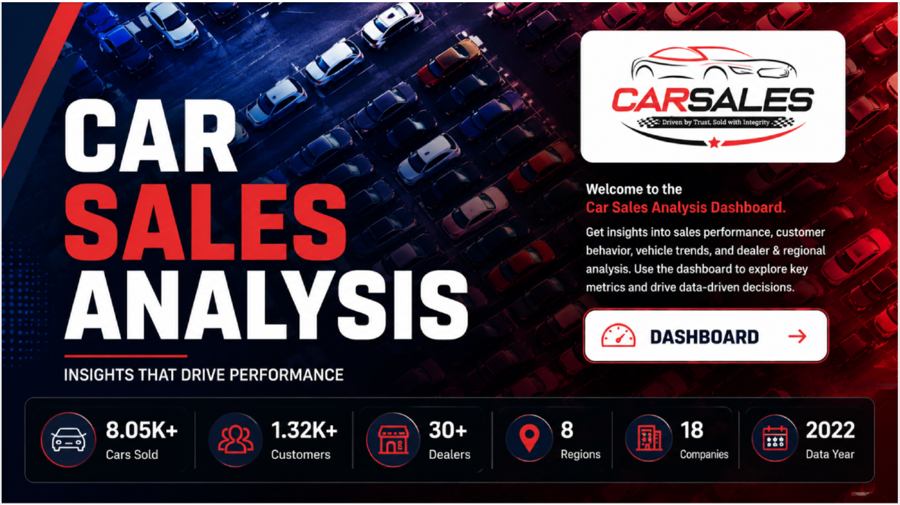
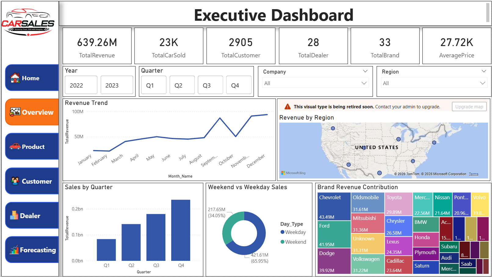
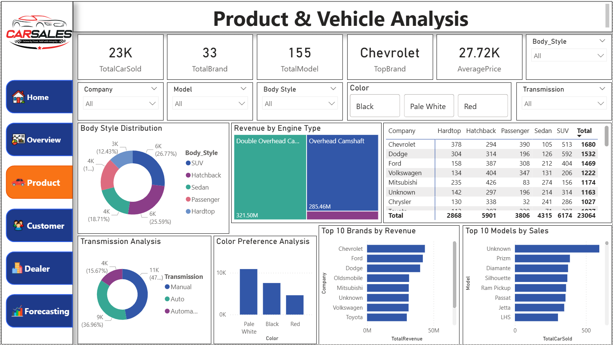
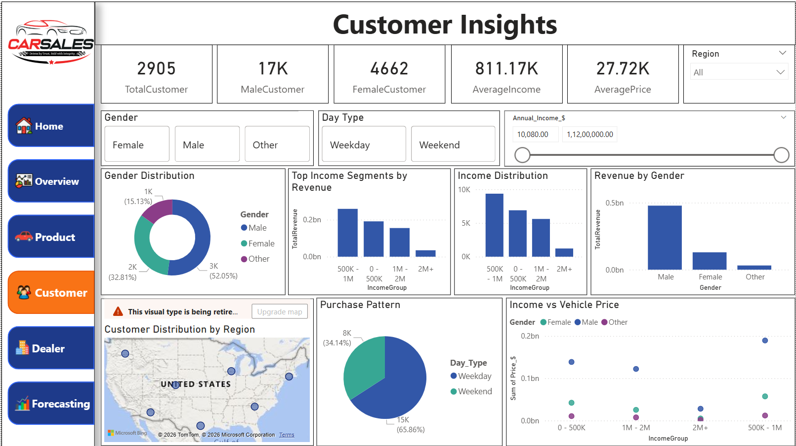
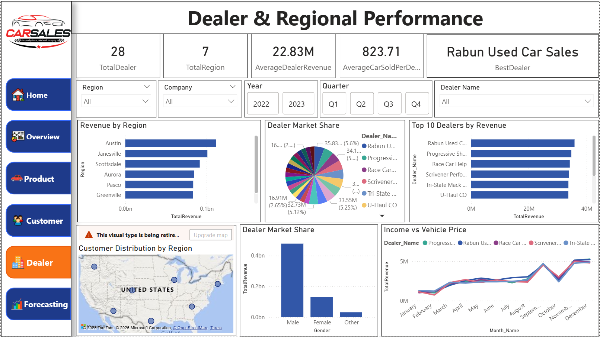
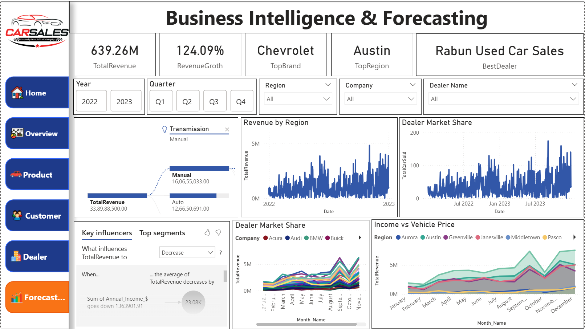

      # 🚗 Car Sales Analysis Dashboard

## 📌 Project Overview

**Car Sales Analysis Dashboard** is an interactive **Power BI Business Intelligence project** developed to analyze automotive sales performance across revenue, vehicles sold, customers, dealers, brands, products, regions, and customer demographics. The project transforms a raw and inconsistent car sales dataset into an analysis-ready data model using **Power Query, DAX, data cleaning, data modeling, KPI development, and interactive data visualizations**.

The dataset required extensive preprocessing due to data quality issues such as missing values, duplicate records, inconsistent formats, incorrect data types, and irregular entries. The project focuses on cleaning and transforming this raw data before developing meaningful business insights.

The project contains six dashboard screens: **Home, Executive Dashboard, Product & Vehicle Analysis, Customer Insights, Dealer & Regional Performance, and Business Intelligence & Forecasting**. Together, they provide a comprehensive view of sales performance, vehicle trends, customer behavior, dealer productivity, regional performance, and business trends.

### 📊 Key Business Metrics

* **639.26M** Total Revenue
* **23K** Total Cars Sold
* **2,905** Total Customers
* **28** Total Dealers
* **33** Total Brands
* **155** Total Models
* **27.72K** Average Vehicle Price
* **7** Total Regions
* **Chevrolet** identified as a leading brand
* **Austin** identified as a leading region
* **Rabun Used Car Sales** identified as the best-performing dealer

---

## 🛠️ Tools & Technologies

* Power BI
* Power Query
* DAX
* Data Modeling
* Data Cleaning
* Data Transformation
* Data Visualization
* Business Intelligence
* KPI Development
* Sales Analytics
* Customer Analytics
* Dealer Analytics
* Automotive Analytics

---

# 🏠 Dashboard 1 — Home

The **Home** screen serves as the landing page for the Car Sales Analysis Dashboard. It introduces the project and provides users with a quick understanding of the analytical areas covered in the report, including sales performance, customer behavior, vehicle trends, dealer performance, regional analysis, and forecasting.

### 📷 Dashboard Preview

### 🔍 Key Analysis

* Project introduction and dashboard navigation
* Quick overview of business analytics areas
* Sales performance analysis
* Customer behavior analysis
* Vehicle and product analysis
* Dealer and regional performance
* Business intelligence and forecasting
* Interactive navigation to detailed dashboard pages

---

# 📊 Dashboard 2 — Executive Dashboard

The **Executive Dashboard** provides a high-level summary of automotive business performance using key KPIs and interactive visualizations. It analyzes revenue trends, cars sold, customers, dealers, brands, average pricing, quarterly performance, regional distribution, and weekday versus weekend sales patterns.

### 📷 Dashboard Preview

### 🔍 Key Analysis

* **639.26M** Total Revenue
* **23K** Total Cars Sold
* **2,905** Total Customers
* **28** Total Dealers
* **33** Total Brands
* **27.72K** Average Vehicle Price
* Monthly revenue trend
* Revenue by region
* Sales by quarter
* Weekday vs. weekend sales
* Brand revenue contribution
* Interactive year, quarter, company, and region filters

---

# 🚘 Dashboard 3 — Product & Vehicle Analysis

The **Product & Vehicle Analysis** dashboard focuses on vehicle-level performance across brands, models, body styles, engine types, transmission types, and color preferences. It helps identify high-performing products, popular vehicle characteristics, and revenue-generating brands to support inventory and product strategy.

### 📷 Dashboard Preview

### 🔍 Key Analysis

* **23K** Total Cars Sold
* **33** Total Brands
* **155** Total Models
* **27.72K** Average Vehicle Price
* Top-performing brand analysis
* Body style distribution
* Revenue by engine type
* Vehicle sales by company and body style
* Transmission analysis
* Color preference analysis
* Top brands by revenue
* Top models by sales
* Interactive company, model, body style, color, and transmission filters

---

# 👥 Dashboard 4 — Customer Insights

The **Customer Insights** dashboard analyzes customer demographics, income distribution, gender, purchasing patterns, regional distribution, and vehicle pricing. It helps identify important customer segments and understand how demographic and income characteristics relate to automotive purchasing behavior.

### 📷 Dashboard Preview

### 🔍 Key Analysis

* **2,905** Total Customers
* Male, female, and other customer distribution
* Average customer income
* Average vehicle price
* Gender-based revenue analysis
* Income segment analysis
* Income distribution
* Customer purchase patterns
* Weekday vs. weekend purchasing behavior
* Regional customer distribution
* Income vs. vehicle price analysis
* Interactive region, gender, day type, and income filters

---

# 🏢 Dashboard 5 — Dealer & Regional Performance

The **Dealer & Regional Performance** dashboard evaluates dealer productivity and regional sales performance using revenue, dealer market share, customer distribution, and top-dealer rankings. It enables users to compare regions and dealers, identify high-performing sales channels, and understand geographic differences in automotive sales.

### 📷 Dashboard Preview

### 🔍 Key Analysis

* **28** Total Dealers
* **7** Total Regions
* **22.83M** Average Dealer Revenue
* **823.71** Average Cars Sold per Dealer
* Best dealer identification
* Revenue by region
* Dealer market share
* Top 10 dealers by revenue
* Customer distribution by region
* Dealer revenue comparison
* Regional performance analysis
* Interactive dealer, company, region, year, and quarter filters

---

# 📈 Dashboard 6 — Business Intelligence & Forecasting

The **Business Intelligence & Forecasting** dashboard combines sales performance analysis with trend-based business intelligence. It evaluates revenue growth, dealer market share, regional performance, income and pricing relationships, and sales patterns to provide insights that can support forecasting, strategic planning, and future business decisions.

### 📷 Dashboard Preview

### 🔍 Key Analysis

* **639.26M** Total Revenue
* Revenue growth analysis
* Top-performing brand identification
* Top-performing region identification
* Best dealer identification
* Revenue by region
* Dealer market share
* Income vs. vehicle price analysis
* Revenue trend analysis
* Monthly performance patterns
* Key Influencers analysis
* Interactive year, quarter, region, company, dealer, and transmission filters

---

## 📁 Dataset

**Dataset:** `car_sales.csv`

The dataset contains automotive sales records covering vehicle information, customer demographics, dealer details, company and brand information, pricing, regions, transmission, body style, income, and sales-related attributes.

Because the original dataset contained significant data quality issues, extensive **data cleaning and transformation** were performed before analysis.

---

## 🧹 Data Cleaning & Transformation

The raw dataset required substantial preprocessing to make it suitable for reliable business analysis. Using **Power Query**, the following data preparation activities were performed:

* Identified and removed duplicate records
* Handled missing and null values
* Corrected inconsistent data types
* Standardized categorical values
* Cleaned inconsistent text entries
* Transformed and structured columns
* Validated business-related fields
* Prepared an analysis-ready dataset
* Created calculated and transformed fields required for reporting

---

## 🎯 Project Objective

The objective of this project is to transform a messy automotive sales dataset into a reliable **Business Intelligence solution** that enables users to monitor sales KPIs, analyze vehicle and brand performance, understand customer behavior, evaluate dealer productivity, compare regional performance, identify business trends, and support data-driven automotive sales decisions.

---

## 📂 Project Files

| File / Folder    | Description             |
| ---------------- | ----------------------- |
| `car_sales.csv`  | Raw car sales dataset   |
| `car_sales.pbix` | Power BI dashboard file |
| `Screenshots/`   | Dashboard screenshots   |
| `README.md`      | Project documentation   |

---

## 👨‍💻 Skills Demonstrated

* Power BI
* Power Query
* DAX
* Data Cleaning
* Data Transformation
* Data Modeling
* Data Visualization
* KPI Development
* Business Intelligence
* Dashboard Development
* Sales Analytics
* Customer Analytics
* Dealer Performance Analysis
* Regional Analysis
* Product Analysis
* Automotive Analytics
* Business Data Analysis

---

📌 **Back to Power BI Projects:** [Power BI Business Intelligence](../)  
🏠 **Back to Main Repository:** [Data Analytics & Visualization Portfolio](../../../../)
