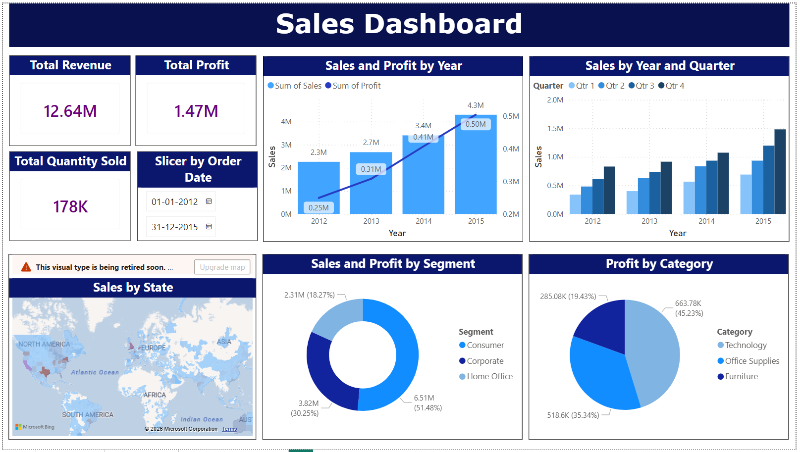
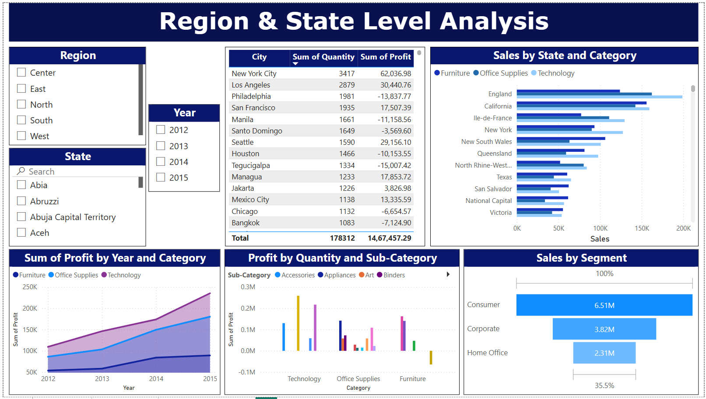
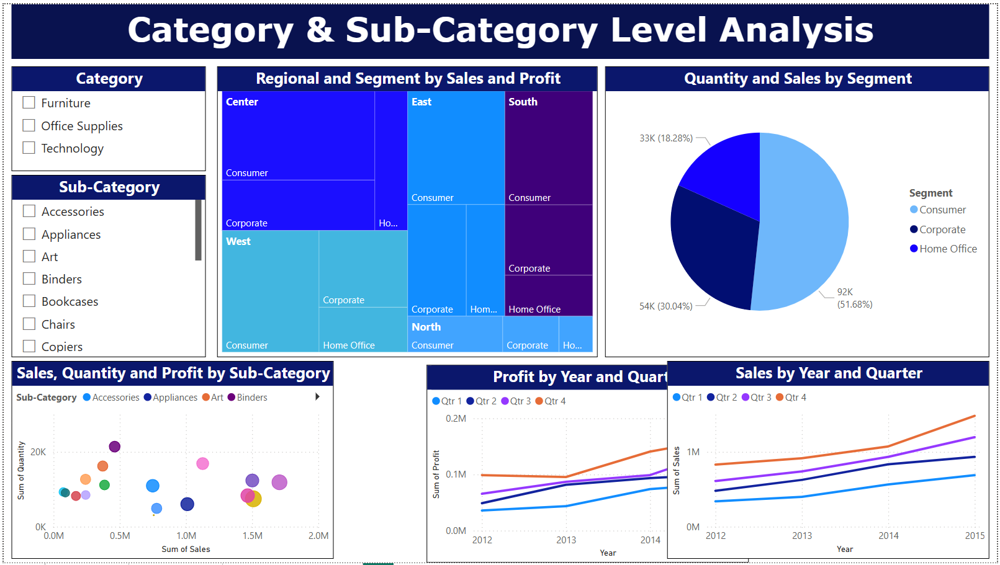

# 🌎 Global Superstore Sales Analysis Dashboard

## 📌 Project Overview

**Global Superstore Sales Analysis Dashboard** is an interactive **Power BI Business Intelligence project** developed to analyze sales, profit, quantity, and overall business performance across multiple dimensions. The project transforms Global Superstore transactional data into actionable insights using **Power Query, DAX, data modeling, KPI development, slicers, and interactive visualizations**.

The project contains three analytical dashboards: **Sales Analysis, Region & State Level Analysis, and Category & Sub-Category Level Analysis**. Together, they provide insights into overall business performance, geographical trends, customer segments, product categories, sub-categories, sales volume, profitability, and time-based performance.

### 📊 Key Business Insights

* **12.64M** Total Revenue
* **1.47M** Total Profit
* **178K+** Total Quantity Sold
* Sales and profit analyzed across **2012–2015**
* Performance analyzed across multiple **regions, states, and cities**
* **Consumer, Corporate, and Home Office** segment analysis
* Profitability comparison across **Technology, Office Supplies, and Furniture**
* Detailed **category and sub-category** performance analysis
* Identification of **high-performing and loss-making markets**

---

## 🛠️ Tools & Technologies

* Power BI
* Power Query
* DAX
* Data Modeling
* Data Cleaning
* Data Visualization
* Business Intelligence
* Sales Analytics
* Time Intelligence
* Geographical Analysis

---

# 📊 Dashboard 1 — Sales Analysis

The **Sales Analysis Dashboard** provides a high-level overview of overall business performance using key KPIs such as total revenue, profit, and quantity sold. It analyzes yearly and quarterly sales trends, geographical sales distribution, customer-segment performance, and profitability across major product categories. The dashboard helps stakeholders quickly identify business growth trends, major revenue contributors, and profitable product categories.

### 📷 Dashboard Preview

### 🔍 Key Analysis

* Total Revenue: **12.64M**
* Total Profit: **1.47M**
* Total Quantity Sold: **178K+**
* Sales and profit by year
* Sales by year and quarter
* Sales by state
* Sales and profit by customer segment
* Profit by product category
* Geographical sales performance
* Overall business performance analysis

---

# 🌎 Dashboard 2 — Region & State Level Analysis

The **Region & State Level Analysis Dashboard** provides detailed geographical analysis of business performance across regions, states, and cities. Interactive filters allow users to analyze performance by region, state, and year while comparing city-level quantity and profit. The dashboard helps identify high-performing markets, loss-making locations, category trends, regional profitability, and customer-segment contributions.

### 📷 Dashboard Preview

### 🔍 Key Analysis

* Region-level performance analysis
* State-level sales and profit analysis
* Year-based performance filtering
* City-level quantity and profit comparison
* Sales by state and category
* Profit by year and category
* Profit by quantity and sub-category
* Sales by customer segment
* High-performing and loss-making markets
* Regional business performance comparison

---

# 🍕 Dashboard 3 — Category & Sub-Category Level Analysis

The **Category & Sub-Category Level Analysis Dashboard** focuses on detailed product-level performance across categories, sub-categories, regions, and customer segments. Interactive filters, treemaps, scatter plots, and time-based visualizations are used to compare sales, quantity, and profit. The dashboard helps identify high-performing products, volume-driven sub-categories, profitability gaps, and opportunities for improving business performance.

### 📷 Dashboard Preview

### 🔍 Key Analysis

* Category-level performance analysis
* Sub-category-level sales and profit analysis
* Sales, quantity, and profit comparison
* Regional and customer-segment contribution
* Consumer, Corporate, and Home Office analysis
* Profit by year and quarter
* Sales by year and quarter
* High-performing sub-category identification
* Volume-driven product analysis
* Profitability gap analysis

---

## 📁 Dataset

**Dataset:** `global_super_Store_2016.csv`

The dataset contains Global Superstore transactional data used to analyze sales, profit, quantity, products, categories, customer segments, regions, states, cities, and time-based business performance.

---

## 🎯 Project Objective

The objective of this project is to transform raw Global Superstore transaction data into an interactive **Business Intelligence solution** that enables users to monitor KPIs, analyze sales and profit trends, evaluate geographical and product performance, identify high-performing and loss-making areas, and generate actionable insights for data-driven business decisions.

---

## 📂 Project Files

| File / Folder                 | Description               |
| ----------------------------- | ------------------------- |
| `global_super_Store_2016.csv` | Global Superstore dataset |
| `global_superstore.pbix`      | Power BI dashboard file   |
| `screenshots/`                | Dashboard screenshots     |
| `README.md`                   | Project documentation     |

---

## 👨‍💻 Skills Demonstrated

* Power BI
* Power Query
* DAX
* Data Modeling
* Data Cleaning
* Data Visualization
* KPI Development
* Business Intelligence
* Sales Analytics
* Time Intelligence
* Geographical Analysis
* Product Analysis
* Customer Segment Analysis
* Dashboard Design

---

📌 **Back to Power BI Projects:** [Power BI Business Intelligence](../)
🏠 **Back to Main Repository:** [Data Analytics & Visualization Portfolio](../../../../)
