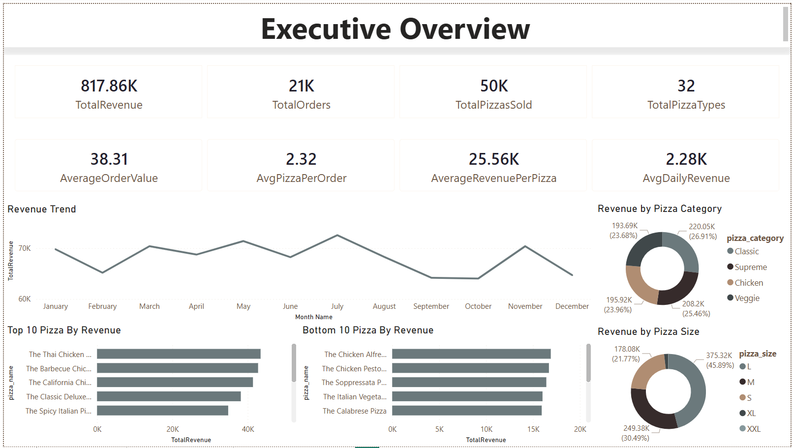
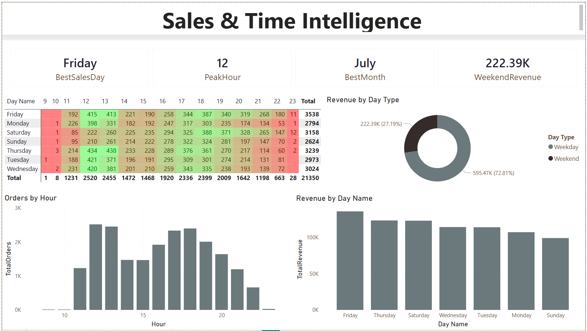
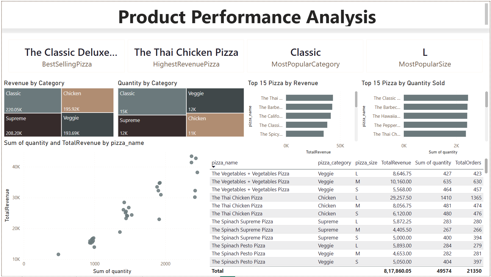

# 🍕 Pizza Sales Analysis Dashboard

## 📌 Project Overview

**Pizza Sales Analysis Dashboard** is an interactive **Power BI Business Intelligence project** developed to analyze pizza sales performance across revenue, orders, quantity sold, products, categories, sizes, and time. The project transforms transactional sales data into actionable business insights using **Power Query, DAX, data modeling, KPI development, and interactive data visualizations**.

The project contains three analytical dashboards: **Executive Overview, Sales & Time Intelligence, and Product Performance Analysis**. Together, they provide insights into overall business performance, sales trends, peak ordering periods, product performance, category contribution, and pizza size preferences.

### 📊 Key Business Insights

* **$817.86K** Total Revenue
* **21K** Total Orders
* **49.6K** Pizzas Sold
* **32** Pizza Types
* **$38.31** Average Order Value
* **Friday** is the best sales day
* **12 PM** is the peak ordering hour
* **July** is the strongest month
* **Classic** is the leading pizza category
* **Large (L)** is the highest-revenue pizza size

---

## 🛠️ Tools & Technologies

* **Power BI**
* **Power Query**
* **DAX**
* **Data Modeling**
* **Data Cleaning**
* **Data Visualization**
* **Business Intelligence**
* **Sales Analytics**
* **Time Intelligence**

---

# 📊 Dashboard 1 — Executive Overview

The **Executive Overview** dashboard provides a comprehensive summary of pizza business performance using key KPIs such as total revenue, orders, pizzas sold, average order value, and revenue per pizza. It analyzes monthly revenue trends, category contribution, pizza sizes, and top and bottom-performing products, helping stakeholders quickly understand overall business performance and identify major revenue drivers.

### 📷 Dashboard Preview

### 🔍 Key Analysis

* Total Revenue: **$817.86K**
* Total Orders: **21K**
* Total Pizzas Sold: **49.6K**
* Total Pizza Types: **32**
* Average Order Value: **$38.31**
* Monthly revenue trend analysis
* Revenue by pizza category
* Revenue by pizza size
* Top 10 pizzas by revenue
* Bottom 10 pizzas by revenue

---

# 📈 Dashboard 2 — Sales & Time Intelligence

The **Sales & Time Intelligence** dashboard analyzes pizza ordering behavior across days, hours, months, and weekday/weekend periods. The dashboard uses a day-hour heatmap and supporting visualizations to identify peak ordering periods, best-performing days, monthly performance, and revenue distribution by day type. These insights can support staffing, inventory planning, promotional scheduling, and operational decisions.

### 📷 Dashboard Preview

### 🔍 Key Analysis

* **Friday** identified as the best sales day
* **12 PM** identified as the peak ordering hour
* **July** identified as the best-performing month
* Weekend revenue: approximately **$222.39K**
* Orders by hour
* Revenue by day name
* Weekday vs. weekend revenue
* Day-hour sales heatmap
* Time-based sales pattern analysis

---

# 🍕 Dashboard 3 — Product Performance Analysis

The **Product Performance Analysis** dashboard provides detailed product-level analysis across revenue, quantity sold, orders, pizza categories, and sizes. It identifies the best-selling and highest-revenue pizzas while comparing category and size performance. Interactive rankings, treemaps, scatter analysis, and detailed tables provide deeper insights into product performance and support data-driven product and sales optimization.

### 📷 Dashboard Preview

### 🔍 Key Analysis

* Best-selling pizza identification
* Highest-revenue pizza identification
* Revenue by pizza category
* Quantity by pizza category
* Top 15 pizzas by revenue
* Top 15 pizzas by quantity sold
* Revenue vs. quantity relationship
* Product-level revenue and order details
* Pizza size performance analysis

---

## 📁 Dataset

**Dataset:** `pizza_sales.csv`

The dataset contains pizza sales transaction data used to analyze revenue, orders, quantities, pizza products, categories, sizes, and time-based sales patterns.

---

## 🎯 Project Objective

The objective of this project is to transform raw pizza sales transactions into an interactive **Business Intelligence solution** that enables users to monitor KPIs, identify sales trends, analyze peak ordering periods, evaluate product performance, and generate actionable insights for data-driven business decisions.

---

## 📂 Project Files

| File / Folder      | Description             |
| ------------------ | ----------------------- |
| `pizza_sales.csv`  | Pizza sales dataset     |
| `pizza_sales.pbix` | Power BI dashboard file |
| `screenshots/`     | Dashboard screenshots   |
| `README.md`        | Project documentation   |

---

## 👨‍💻 Skills Demonstrated

- Power BI
- Power Query
- DAX
- Data Modeling
- Data Cleaning
- Data Visualization
- KPI Development
- Business Intelligence
- Sales Analytics
- Time Intelligence
- Product Analysis
- Dashboard Design

---

📌 **Back to Power BI Projects:** [Power BI Business Intelligence](../)  
🏠 **Back to Main Repository:** [Data Analytics & Visualization Portfolio](../../../../)